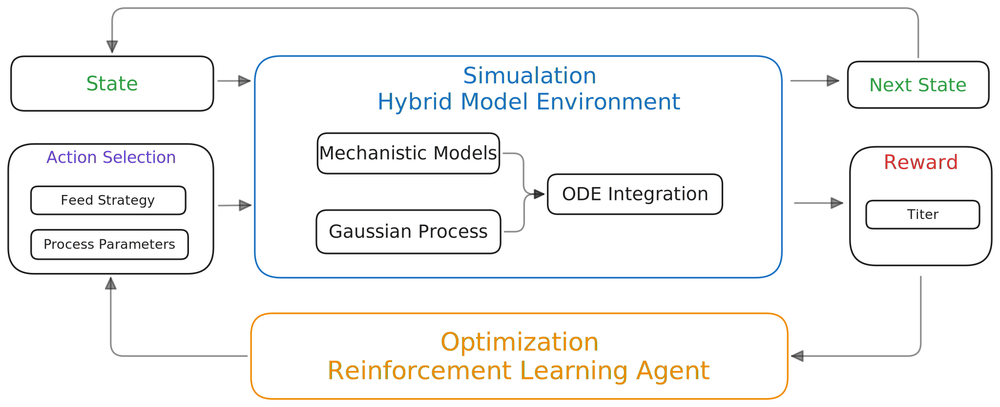
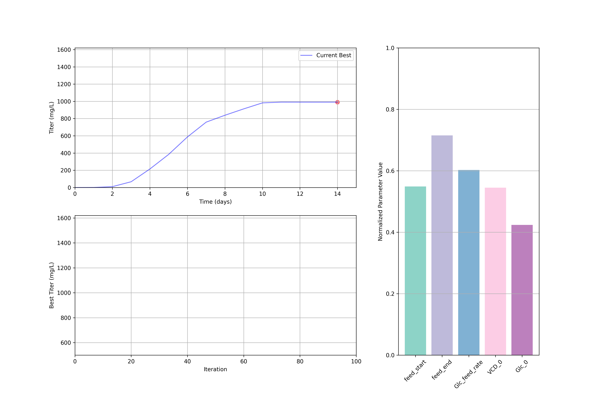

# Reinforce-Bio: Leveraging Reinforcement Learning and Hybrid Modeling for Bioprocess Optimization
---



Reinforce-Bio is a research project focused on leveraging reinforcement learning to optimize bioprocess parameters and improve efficiency in biological systems. 

## Overview

Bioprocess optimization is a critical area in biotechnology, aiming to enhance the production of biologics such as monoclonal antibodies, vaccines, and enzymes. The project explores hybrid modeling, combining mechanistic models and machine learning, to better understand and optimize complex biological systems.



Currently, this repository contains models and methods for hybrid modeling and simulation of bioprocesses, with an emphasis on integrating data-driven approaches like Gaussian Process (GP) modeling. The project implements a reinforcement learning optimization model that can identify the optimal process conditions for maximizing product yield and minimizing costs.

### Key Features

- **Hybrid Gaussian Process Models**: Combines mechanistic and data-driven approaches to model bioprocess dynamics.
- **Simulation Module**: Predict bioprocess states under varying process parameters.
- **Sensitivity Analysis**: Evaluate the impact of key process parameters on bioprocess outcomes.
- **Reinforcement Learning Optimization Module**: Identify optimal process conditions for maximizing product yield and minimizing costs.

## Simulation: Hybrid Model

The hybrid model integrates both mechanistic and machine learning components to capture the dynamics of a bioprocess. It uses Gaussian Process (GP) regression to model the derivatives of key state variables (e.g., cell density, glucose concentration) and employs Ordinary Differential Equations (ODEs) to simulate state evolution over time.

### Key Data Scopes

1. **State Variables**:
   - Cell density (VCD)
   - Glucose concentration
   - Lactate concentration
   - Product titer

2. **Process Conditions**:
   - Feed rates
   - Feed Start Day
   - Feed End Day
   - Initial conditions (e.g., initial glucose and cell density)

## Optimization: Deep Deterministic Policy Gradient (DDPG)

The optimization module leverages the DDPG algorithm to identify optimal process conditions. By simulating a range of parameter combinations, the framework evaluates their impact on product yield and other performance metrics, ultimately selecting the best conditions.

### Optimization Results

After running the optimization process, the system will display the optimal process conditions found, including:

- Initial process parameters (feed start/end days, initial glucose and cell density)
- Daily feeding rates for the entire process duration
- Final product titer achieved
- Episode number where the best result was found

Example output:
```
Current optimal process conditions:
feed_start: 1.8562
feed_end: 8.3028
Glc_0: 44.0554
VCD_0: 0.5488

Daily feeding rates (mg/L):
Day 1: 11.1716
Day 2: 12.2233
Day 3: 10.3142
...
Day 15: 8.1669

Predicted final titer: 1518.27 mg/L
Found in episode: 216
```

This output provides a comprehensive view of the optimized process conditions and their predicted performance.

## Getting Started

### Prerequisites

- Python 3.10.x

### Installation

1. Clone the repository:
   ```bash
   git clone https://github.com/deepbiolab/reinforce-bio.git
   ```
2. Install dependencies:
   ```bash
   pip install -r requirements.txt
   ```

### Running Hybrid Model

0. Ensure your environment is properly configured in `src/config.py`

1. **Training Mode**:
   ```bash
   python run_hybrid_model.py --mode train
   ```
   This will:
   - Train new GP models using the training dataset
   - Save the trained models to `checkpoints/hybrid_model.pkl`
   - Evaluate performance on both training and test sets
   - Display metrics (RMSE and R² scores) for each state variable
   - Generate visualization plots for selected runs

2. **Testing Mode**:
   ```bash
   python run_hybrid_model.py --mode test
   ```
   This will:
   - Load previously trained models from `checkpoints/hybrid_model.pkl`
   - Evaluate performance on the test dataset
   - Display test metrics for each state variable
   - Generate comparison plots between predicted and actual values

3. **Prediction Mode**:
   ```bash
   python run_hybrid_model.py --mode predict
   ```
   This will:
   - Load trained models
   - Make sure data is available in the `dataset/interpolation/predict` directory
   - Generate predictions for new process conditions
   - Save predictions to the results directory
   - Create visualization plots of the predicted profiles

### Running Optimization

To run the optimization process:

0. Ensure your environment is properly configured in `src/config.py`
1. Run the main script:
   ```bash
   python run_optimization.py
   ```

The optimization process will display progress and eventually show the optimal conditions found, as demonstrated in the example above.

> For more details, refer to the documentation in the `report/` folder or the notebooks in the `notebook/` folder.

## Citation

If you find this project useful in your research, please cite it as follows:
```bibtex
@software{reinforce_bio2025,
  author       = {Tim-Lin},
  title        = {Reinforce-Bio: Leveraging Reinforcement Learning and Hybrid Modeling for Bioprocess Optimization},
  year         = {2025},
  publisher    = {GitHub},
  url          = {https://github.com/deepbiolab/reinforce-bio}
}
```